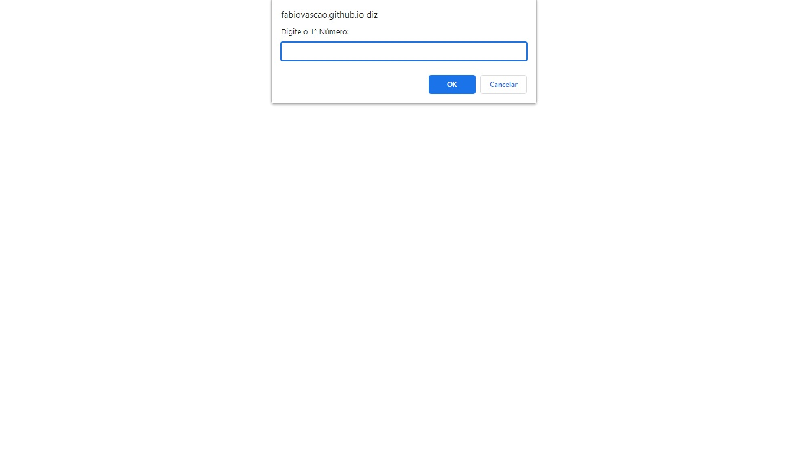

# Desafio Recriando Layout

Desafio do Stage04 que faz parte do Programa Explorer da Rocketseat  

💡 O que será abordado nesse desafio:  

- Variáveis;
- Operações matemáticas;
- Operadores comparativos;
- Condicional.

Bora praticar e rever tudo o que foi ensinado na aula? **💜**   
Nesse desafio, você irá solicitar ao usuário que ele insira **dois números** e, a partir daí, calcular:   

- [ ]  A soma dos dois números;
- [ ]  A subtração dos dois números;
- [ ]  A multiplicação dos dois números;
- [ ]  A divisão dos dois números;
- [ ]  O resto da divisão dos dois números;

Fácil até aqui, né? Bora se desafiar? 👀 🧑‍🚀   

- [ ]  Verifique se a soma dos dois números é par ou ímpar;
- [ ]  Verifique se os dois números inseridos são iguais ou diferentes.

Lembre-se de sempre mostrar na tela o resultado de cada uma dessas operações!   

## Screenshots

[🔗 Clique aqui para acessar o Projeto](https://fabiovascao.github.io/JavaScript-Desafio1/)  

## 🛠 Tecnologias

- HTML
- CSS
- Git e Github
- JavaScript

## Autor

- [@FabioVascão](https://www.github.com/fabiovascao)